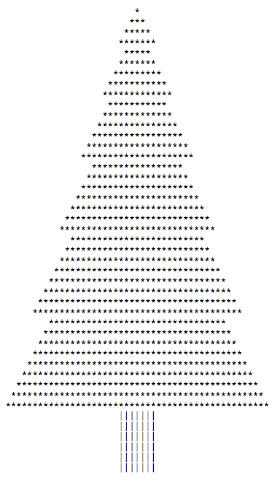

# Welcome to Damien Chave Coding Work 

**[Damien Chave](https://damien-chave.github.io/Home/CV%20Damien%20Chave.pdf)** made his entrance in 2018 at **[Coding Academy](http://www.coding-academy.fr/la-formation)** by **[EPITECH](http://www.epitech.eu/coding-academy.aspx)** in Lyon.

Initially coming from technical training in electronics and home automation, he passed a complementing marketing and commerce master graduation. Following these studies, he traveled and worked in various professional environments with various positions qualifications, somewhat in Australia and in France (his home country).

With this intensive training he went a step forward into technology environment, particularly in web development. The formation he is doing has prooven its pedagogical method for years from EPITA and EPITECH, defined through project-based learning. 

## Links

The training includes C language, HTML & CSS, Bootstrap, SQL, PHP, JavaScript (jQuery), MEAN and Laravel, Symfony frameworks. During the formation, some projects (made in short time, max 5 days/project) has been released here, out of EPITECH servers, to show you some of school exercises and what he was able to do.

#### Here are some pages of Damien's work...

- A Fir Tree compiled in C language :
 

- An example of JavaScript exercises :
 

- A copying Front-End exercise with Batman :
 

- The Game of 2048 (customized) :
 

The code of his work examples is publicly available here 

## Internship to offer ?

To validate his certificate's formation, Damien Chave will do an internship during approximately 4 months from the October 15th. 
Are interested to collaborate with him ?
Do not hesitate to [send him an email](mailto:damien.chave.pro@gmail.com) and you can also fill the [form](https://docs.google.com/forms/d/e/1FAIpQLSe5XfgPAcuN6r-FDk90TFcjHp_HXorV7jOqLE_VWCqWw3SCug/viewform?usp=sf_link).

## Resume

